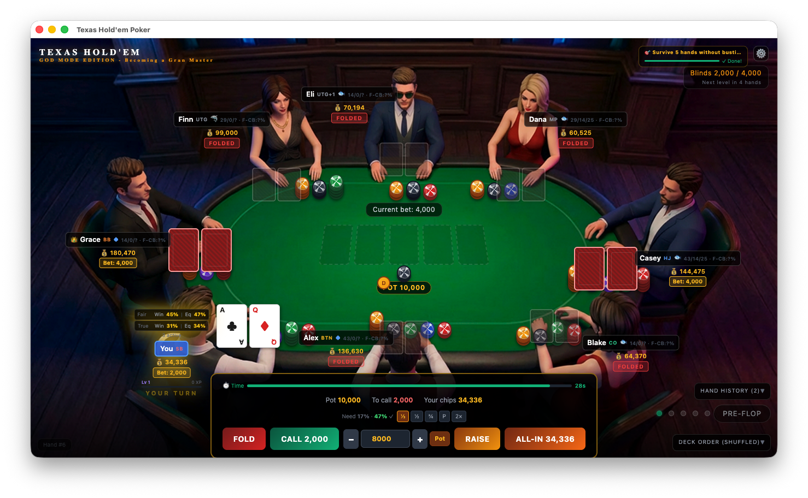
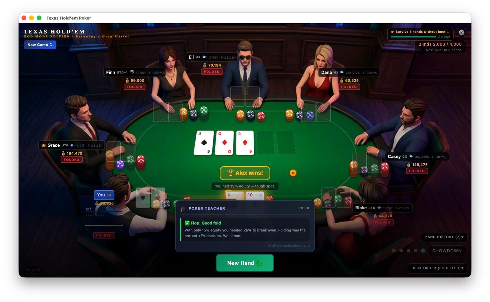

# Texas Hold'em Poker — Gran Masters Edition

> **GOD MODE EDITION — Becoming a Gran Master**

A fully-featured Texas Hold'em poker simulator built with **Electron**, **TypeScript**, and **TailwindCSS v4**. Designed as a single-page, offline desktop game with a fixed-canvas layout, multi-archetype AI opponents, real-time equity calculation, rich visual/audio feedback, XP progression, daily challenges, persistent save state, a post-hand **Poker Teacher** analysis panel, an **Equity Calculator**, a live **Action Log**, **Session Replay**, a **Live Pot Odds Arc**, and **Voice Announcements**.

---

## Screenshots

### Gameplay — Action Panel


*Pre-flop action with A♣ Q♦. The bottom HUD shows pot odds (need 17%, you have 47% ✓), quick bet-size presets, and the 30-second time bank. Player badges show VPIP/PFR stats and position labels. The chip-leader crown (👑) marks the current stack leader.*

### Post-Hand — Poker Teacher Panel


*After folding on the flop, the 🎓 Poker Teacher panel appears above the "New Hand" button. It confirms the fold was correct (+EV), shows the user's hole cards in the header, and explains the reasoning. The community cards and winner announcement remain visible.*

---

## Table of Contents

- [Tech Stack](#tech-stack)
- [Project Structure](#project-structure)
- [Architecture Overview](#architecture-overview)
- [Game Engine](#game-engine)
- [AI System](#ai-system)
- [Equity Engine](#equity-engine)
- [Rendering System](#rendering-system)
- [Animation System](#animation-system)
- [Audio System](#audio-system)
- [UI Panels & Controls](#ui-panels--controls)
- [Equity Calculator](#equity-calculator)
- [Action Log Panel](#action-log-panel)
- [Session Replay](#session-replay)
- [Live Pot Odds Arc](#live-pot-odds-arc)
- [Voice Announcements](#voice-announcements)
- [Dynamic Music Drone](#dynamic-music-drone)
- [Poker Teacher Analysis](#poker-teacher-analysis)
- [Progression & Achievements](#progression--achievements)
- [Statistics Tracking](#statistics-tracking)
- [Save & Resume](#save--resume)
- [Settings Panel](#settings-panel)
- [Keyboard Shortcuts](#keyboard-shortcuts)
- [Build & Run](#build--run)
- [Configuration & Constants](#configuration--constants)

---

## Tech Stack

| Layer | Technology |
|---|---|
| Desktop shell | Electron 41 |
| Language | TypeScript 6 (strict mode) |
| Bundler | Webpack 5 (3 separate configs for main, preload, renderer) |
| Styling | TailwindCSS v4 + custom CSS (animations, 3D effects) |
| Randomness | `crypto.getRandomValues` (CSPRNG) for deck shuffles |
| Audio | Web Audio API + optional `.ogg` file-based overrides (copied to dist via `CopyPlugin`) |
| Equity | Monte Carlo simulation (up to 2,500 iterations); heads-up equity via `calcHeadsUpEquity` |
| Voice | Web Speech API (`SpeechSynthesisUtterance`) |
| Persistence | `localStorage` (save/resume, card back preference, daily challenge, voice/music settings) |

---

## Project Structure

```
src/
├── main/
│   └── main.ts                  # Electron main process — window creation, aspect ratio
├── preload/
│   └── preload.ts               # Context bridge (contextIsolation: true)
└── renderer/
    ├── index.ts                 # Full UI engine (~3,700+ lines)
    ├── index.html               # Single-div shell
    ├── styles.css               # TailwindCSS import + custom keyframes/classes
    ├── assets.d.ts              # PNG asset type declarations
    ├── assets/
    │   └── audio/               # Optional .ogg sound files (copied to dist by CopyPlugin)
    └── game/
        ├── deck.ts              # Card types, CSPRNG shuffle, suit/rank utilities
        ├── gameState.ts         # Full game state model, blind logic, bet application
        ├── bettingAI.ts         # Multi-archetype AI decision engine
        └── winProbability.ts    # Monte Carlo equity + heads-up equity + position/fold probability
```

---

## Architecture Overview

### Fixed-Canvas Scaling

The renderer renders into a **1366×768 fixed canvas** (`#game-canvas`) that is CSS-transformed to fill the window while preserving the 16:9 aspect ratio. The Electron window enforces this ratio via `win.setAspectRatio(1366/768)` and `useContentSize: true`.

```typescript
// Canvas scale formula (applied on every resize)
const scale = Math.min(window.innerWidth / BASE_W, window.innerHeight / BASE_H);
const tx = (window.innerWidth - BASE_W * scale) / 2;
const ty = (window.innerHeight - BASE_H * scale) / 2;
canvas.style.transform = `translate(${tx}px,${ty}px) scale(${scale})`;
```

All pixel positions in the game (seat positions, chip positions, pot position) are defined in **canvas-space coordinates** and converted to screen coordinates via `canvasToScreen(cx, cy)` for overlay elements that live outside the canvas (chip flight animations, confetti).

### Render Cycle

The entire UI is rebuilt on every `render()` call — there is no virtual DOM or diffing. The canvas `innerHTML` is cleared and rebuilt from scratch each frame. This keeps state management trivial at the cost of some raw DOM work.

The single exception is the **`#anim-layer`** — a `position:fixed` overlay appended to `document.body` (not inside the canvas) that persists across `render()` calls. All flying-chip and confetti animations live here.

### State Architecture

All game state lives in a single **`GameState`** object (defined in `gameState.ts`). UI-only state (deck panel expanded, history panel expanded, thinking player ID, user action resolver, per-hand teacher context, action log, replay snapshots, etc.) lives as module-level variables in `index.ts`. There is no external state library.

---

## Game Engine

### GameState Interface (`gameState.ts`)

Key fields:

```typescript
interface GameState {
  players: Player[];               // Always 8 — busted players remain as ghosts
  deck: Card[];                    // Live remaining deck (decreases as cards dealt)
  originalDeck: Card[];            // Full shuffled order (for deck panel display)
  communityCards: Card[];          // 0–5 community cards
  burnedCards: Card[];             // 0–3 burned cards
  phase: GamePhase;                // idle | dealing | preflop | flop | turn | river | showdown
  dealerButtonPosition: number;    // Seat index 0–7
  pot: number;
  currentBet: number;
  minRaise: number;
  lastAggressorId: number | null;  // For action ordering
  winnerIds: number[];             // All pot winners (including different side-pot winners)
  splitPotWinnerIds: number[];     // Only players who genuinely split the *same* pot
  smallBlind: number;
  bigBlind: number;
  blindLevel: number;              // 0–7
  handNumber: number;              // Increments each hand
  nextBlindHandNumber: number;     // Hand at which next escalation fires
  sessionStats: SessionStats;      // Running session totals
  userProfile: UserProfile;        // Opponent profiling data
  dailyChallenge: DailyChallenge;  // Today's rotating goal
}
```

### Player Interface

```typescript
interface Player {
  id: number;
  name: string;
  position: number;               // Seat 0–7
  skill: number;                  // 0.0–1.0
  archetype: PlayerArchetype;     // shark | balanced | fish | maniac
  chips: number;
  holeCards: Card[];
  roundBet: number;               // Bet amount this street
  hasActed: boolean;
  isFolded: boolean;
  isBusted: boolean;
  isAllIn: boolean;
  isDealer: boolean;
  isUser: boolean;
  handResult?: HandResult;
  wasPreFlopAggressor: boolean;   // Tracks c-bet eligibility
  bluffCount: number;             // Bluffs caught at showdown
  handsPlayed: number;
  vpipCount: number;              // Pre-flop voluntary investment count
  pfrCount: number;               // Pre-flop raise count
  xp: number;                     // Accumulated XP (user only)
  level: number;                  // Current level 1–10 (user only)
}
```

### Blind Escalation

Blinds escalate every **5 hands** through 8 levels:

| Level | Small Blind | Big Blind |
|---|---|---|
| 0 | 1,000 | 2,000 |
| 1 | 2,500 | 5,000 |
| 2 | 5,000 | 10,000 |
| 3 | 10,000 | 20,000 |
| 4 | 20,000 | 40,000 |
| 5 | 40,000 | 80,000 |
| 6 | 75,000 | 150,000 |
| 7 | 150,000 | 300,000 |

From **level 4+**, an **ante** equal to 10% of the big blind is collected from all non-busted players before blinds are posted.

### Heads-Up Rules

When exactly 2 players remain, standard heads-up rules apply:
- The **dealer posts the Small Blind** and acts first pre-flop
- The **non-dealer posts the Big Blind** and acts second pre-flop

### Hand Evaluation

`evaluateHands()` scores each non-folded player's best 5-card hand from 7 available cards (2 hole + 5 community). Hand ranks (high card → royal flush) are scored as integers for direct comparison.

### Side Pot Calculation

`buildSidePots()` uses a **level-peeling algorithm** with `carryover` to correctly handle all-in players:

1. Entries are sorted by `handContribution` ascending
2. At each level, chips are peeled off proportionally across all players at that level
3. A `carryover` accumulator prevents chip loss when the lowest-contribution player is folded — the orphaned chips roll into the next eligible pot
4. Players eligible to win each pot are tracked separately, allowing correct multi-way side pot resolution

```
Main pot  → eligible: all non-folded players
Side pot  → eligible: players who matched the all-in amount
```

A player is only added to `allWinnerIds` for **contested pots** (`eligible.length > 1`) or fold-win paths. Single-eligible pots (uncovered chip refunds) are awarded silently without advertising the recipient as a winner.

### Winner Banner Disambiguation

The winner announcement distinguishes four cases:

| Scenario | Banner Style |
|---|---|
| **Genuine tie** (`splitPotWinnerIds.length > 1`) | Indigo — "🤝 Split pot! A & B tie with [hand]" |
| **Multi-pot** (different side-pot winners) | Lists each winner with their pot label |
| **Solo winner** | Gold — "🏆 [Name] wins with [hand]!" |
| **1v1 showdown** | Shows both hands: "[PlayerA]: [hand] vs [PlayerB]: [hand]" with green/red colouring |

`splitPotWinnerIds` tracks only players who **genuinely tied the same pot** (identical hand score). `winnerIds` may include multiple players who each won a *different* side pot. The UI uses `splitPotWinnerIds` to decide whether to display "TIE!" or "WINNER!" on each player's badge.

### Chip Animation to All Winners

After `awardPot()`, chip tokens animate from `POT_CANVAS` to **every winner's** chip position staggered 180ms apart. For split pots each winner receives `pot / n` chips; for side pots each winner receives their individual pot share.

### Session Stats (`SessionStats`)

```typescript
interface SessionStats {
  handsPlayed: number;
  handsWon: number;
  biggestPot: number;
  netChips: number;
  byPosition: Record<string, { played: number; won: number }>;
}
```

Updated after each hand. Displayed in the **session dashboard** when the user busts or wins the tournament.

### Daily Challenge (`DailyChallenge`)

A rotating daily goal cycles every 24 hours. There are 6 challenge types, selected by `day-of-year mod 6`:

| Type | Description | Goal |
|---|---|---|
| `win_hands` | Win N hands today | 3 |
| `survive_rounds` | Play N hands without busting | 10 |
| `big_pot` | Win a pot over N chips | 50,000 |
| `bluff_win` | Win a hand where you had < 30% equity | 1 |
| `allin_win` | Win an all-in confrontation | 1 |
| `level_up` | Reach level N | 3 |

Progress is shown in the top-right banner. Completing a challenge awards **500 bonus XP** and a toast notification.

---

## AI System

### Player Archetypes (`bettingAI.ts`)

Each AI player is assigned an archetype based on their `skill` value:

| Archetype | Skill Range | Behaviour |
|---|---|---|
| `shark` | ≥ 0.85 | Bluffs 25%, position-aware, pot-odds-accurate, adapts to user profile |
| `balanced` | ≥ 0.65 | Bluffs 12%, moderate variance |
| `fish` | ≥ 0.35 | Bluffs 3%, ignores position, ±10% equity noise |
| `maniac` | < 0.35 | Bluffs 40%, raises randomly 30% of the time |

### Decision Pipeline (`decideAIBet`)

For each AI turn, the following pipeline runs in order:

1. **Equity lookup** — fetch pre-computed equity from `calcAllEquities()`
2. **Pot odds** — `callAmount / (pot + callAmount)` — fold if equity < pot odds
3. **SPR calculation** — `effectiveStack / pot`
   - SPR < 2: commit more readily with top pair+
   - SPR > 10: fold marginal hands more
4. **Position bonus** — sharks get +0.07 equity bonus on BTN, +0.05 on CO
5. **Fish noise** — ±10% random equity variance for fish
6. **Opponent profiling** — sharks 3-bet the user more lightly when `foldToThreeBetRate > 60%`
7. **Board texture** — post-flop bet sizing adapts to `dry / semi-wet / wet` boards
8. **GTO preflop thresholds** — position-keyed open/fold thresholds (82% fold compliance)
9. **Short-stack push/fold** — < 15 BB: only jam (if perceived equity > 44%) or fold pre-flop
10. **Maniac overrides** — 30% chance of raise regardless of hand strength
11. **Fish randomness** — 12% chance of completely random action
12. **Continuation bet** — pre-flop aggressors bet flop 60% of the time
13. **Semi-bluff** — flush draw or straight draw detected → raise 40%
14. **Pure bluff** — missed draw + ≤ 2 opponents + in position → raise at archetype bluff frequency
15. **Equity thresholds** — check/call/raise decision tree with pot-odds comparison

### GTO Preflop Open Thresholds

Position-keyed minimum equity to open, implementing a simplified range chart:

| Position | Dist | Equity Threshold | ~Open % |
|---|---|---|---|
| BTN | 0 | 0.28 | ~50% |
| CO | 7 | 0.32 | ~35% |
| HJ | 6 | 0.36 | ~25% |
| MP | 5 | 0.39 | ~18% |
| UTG+1 | 4 | 0.41 | ~14% |
| UTG | 3 | 0.43 | ~12% |
| SB | 1 | 0.30 | ~55% |
| BB | 2 | 0.22 | ~75% defend |

### Board Texture Bet Sizing

Post-flop bet sizes are scaled by board texture, measured as a fraction of pot:

| Phase / Texture | Fraction |
|---|---|
| Dry board | 0.33× pot |
| Semi-wet board | 0.55× pot |
| Wet board | 0.75× pot |
| River (strong hand) | 1.2× pot (overbet) |
| River (medium hand) | 0.75× pot |
| River (thin value) | 0.50× pot |

### Opponent Profiling

The AI tracks the user's `foldToThreeBetRate` via the `UserProfile` object in `GameState`:

```typescript
interface UserProfile {
  foldToThreeBetOpps: number;   // Times user faced a 3-bet
  foldToThreeBetCount: number;  // Times user folded to a 3-bet
  openCount: number;            // Times user raised first-in preflop
  handsDealt: number;
}
```

When the sample size exceeds 3 hands and the fold-to-3-bet rate exceeds 60%, sharks boost their 3-bet frequency by +12% against the user.

### Timing Tells

Think time is computed by `computeThinkTime()` based on the player's equity:

| Hand Strength | Think Time |
|---|---|
| Very strong (equity > 0.75) | 80–200ms (snap) |
| Very weak (equity < 0.15) | 100–250ms (snap fold) |
| Marginal (0.3–0.5 equity) | 700–1,200ms (long think) |
| Otherwise | Interpolated + skill variance |

### Speech Bubbles

On 30% of AI actions, a speech bubble appears near the player's info panel for 1.5 seconds, chosen from action-specific phrase pools:

- **Raise**: "Feeling lucky?", "Let's raise the stakes", "I like my hand"
- **Fold**: "Not my day", "I'll sit this one out"
- **Call**: "I'll see that", "Worth a look"
- **All-in**: "All in, baby!", "Everything on the line!", "Let's dance!"

### AI Memory

`bluffCount` on each `Player` tracks how many times they've been caught bluffing at showdown. AI opponents reduce their fold threshold against high-bluff players, effectively calling them lighter (`-0.02` fold chance per bluff caught, capped at `-0.10`).

---

## Equity Engine

### Monte Carlo Simulation (`winProbability.ts`)

Two simulation modes are used:

**`simFair()`** — for display equity (user vs unknown opponent hands):
- Unseen pool: `originalDeck` minus user hole cards, community cards, and burned cards
- Randomly assigns opponent hands from the unseen pool
- Simulation counts: pre-flop 2,500 | flop 1,800 | turn 1,200 | river 1,200

**`simTrue()`** — for display equity (using actual revealed opponent cards):
- Uses `state.deck` (live remaining deck) for community card completion
- Simulation counts: pre-flop 2,500 | flop 1,800 | turn 1,200 | **river: deterministic (0 sims)**

**`calcAllEquities()`** — for AI decisions:
- Runs 800 simulations with all active players' actual hole cards
- River: 1 deterministic evaluation (no sampling needed)
- Returns `Map<playerId, equityFraction>`

**`calcHeadsUpEquity(hand1, hand2, board, sims)`** — for the Equity Calculator:
- Runs up to 8,000 simulations for two specific hole card combinations against an optional partial board
- Returns `{ win1, win2, tie }` as percentages

### Metrics Reported

- **`winPct`**: percentage of simulations where the user wins outright
- **`equityPct`**: win + (tie share × 1/n) — expected value fraction

Both `fair` (unknown opponents) and `true` (known opponents) are calculated and displayed in the user's info panel simultaneously.

### Position & Fold Probability

`foldProbability()` combines multiple factors into a 0–1 fold score:

- **Base threshold** by street: pre-flop 14%, flop 11%, turn 9%, river 7%
- **Position multiplier**: BTN 0.55× (looser), UTG 1.35× (tighter)
- **Hand quality**: `preflopHandQuality()` and `postflopHandQuality()`
- **Fish blending**: fish partially ignore position
- **Skill noise**: up to ±28% random variance for fish, 0% for sharks

---

## Rendering System

### Seat & Info Panel Layout

Cards and player info panels are rendered at **separate pixel positions**:

```typescript
const SEAT_POSITIONS: {x,y}[]  // Where hole cards render
const INFO_POSITIONS: {x,y}[]  // Where name/chip panels render
const CHIP_POSITIONS: {x,y}[]  // Where 3D chip stack visualisations render
```

### 3D Chip Stacks

Chip stacks are rendered as **individual DOM elements** with:
- Conic-gradient CSS stripes (8-segment casino pattern)
- Per-chip `box-shadow` bottom face simulating 3D depth
- Inner debossed ring + specular glint highlight
- 6 denominations: gold (25K), black (10K), purple (5K), green (1K), blue (500), red (100)

### Pot Display

The pot chip stack is rendered as soon as `pot > 0` and remains visible through all phases including blind posting. Chips animate from each player's position to the pot center with a `cubic-bezier` ease-out transition, then fade out — the static pot label and chip pile appear immediately, driven by `renderPotOnTable()`.

### Equity Sparkline

For the user's info panel, an inline SVG **equity sparkline** renders when equity data from ≥ 2 streets is available. Each street's `fair.equityPct` value is plotted as a polyline (80×24px SVG), with the current value highlighted as a coloured dot (green if > 50%, red if < 30%, yellow otherwise).

### XP Bar

The user's info panel shows a progress bar for the current XP level. The bar fills proportionally between the XP threshold for the current level and the next level. The level badge and XP/needed text are displayed inline.

```
Level 4  ████████░░  2,340 / 5,000 XP
```

### Backgrounds

Two background images are swapped at runtime:

| State | Image |
|---|---|
| Idle (before first deal) | `PokerRoom.png` — empty table, no players |
| Active game | `poker_table_players.png` — table with 3D seated players |

### Community Cards — 3D Perspective

Community cards are rendered in a CSS 3D perspective wrapper:
```css
perspective: 500px;
perspective-origin: 50% -40%;
transform: rotateX(28deg);
```

---

## Animation System

All flying animations use the **`#anim-layer`** — a `position:fixed; z-index:500` overlay appended to `document.body`, outside the canvas.

### Chip Flight to Pot (`animateChipsToPot`)

Triggered after every blind post, call, raise, or all-in:
1. Chip tokens created at screen-space position of `CHIP_POSITIONS[seatIdx]`
2. CSS `transition: transform 0.42s cubic-bezier` moves them to `POT_CANVAS`
3. Tokens fade out and self-remove after 560ms

The static pot chip stack is rendered immediately by `renderPotOnTable()` (which displays as soon as `pot > 0`), so the pot always looks correct after the animation completes.

### Chip Slide to Winner (`animateChipsToWinner`)

After `awardPot()`, 4–6 chip tokens animate from `POT_CANVAS` to the winner's `CHIP_POSITIONS` entry.

### Confetti Burst

On user win: 30 `div` particles, 6×6px, random chip colors, animate with CSS `--confetti-end` over 1.2s.

### Deal Animation

Cards are dealt one at a time to each seat using the `dealCard` keyframe:
```css
@keyframes dealCard {
  from { opacity: 0; transform: translateY(-120px) rotate(-15deg) scale(0.5); }
  to   { opacity: 1; transform: translateY(0) rotate(0deg) scale(1); }
}
```

### Showdown Reveal

At showdown, opponent cards flip in sequence with 300ms delays using the `flipCard` keyframe (rotateY 0° → 90° → 0°).

### Best-Hand Card Glow (`card-best-hand`)

At showdown, the **winning 5 cards** (the exact combination forming the best hand, from `HandResult.bestHand`) are highlighted with a pulsing gold-to-orange glow and lifted slightly. All other cards in the winner's hand dim to a secondary style.

Cards are matched by `data-rank` / `data-suit` HTML attributes against a `Set<string>` of `rank-suit` keys. Community cards that are part of the best hand are highlighted in the same pass.

```css
@keyframes bestHandPulse {
  0%, 100% { box-shadow: 0 0 0 2px #fbbf24, 0 0 14px 4px rgba(251,191,36,0.7); }
  50%       { box-shadow: 0 0 0 3px #f97316, 0 0 24px 8px rgba(249,115,22,0.8); }
}
.card-best-hand {
  animation: bestHandPulse 1.2s ease-in-out infinite;
  transform: translateY(-6px) scale(1.07);
}
```

### Bust Shake Animation (`player-busting`)

When a player's chip count reaches 0 after `awardPot()`, they are added to `recentlyBustedIds`. On the next `render()` their info panel receives the `player-busting` class, triggering a dramatic shake:

```css
@keyframes bustShake {
  0%   { transform: translate(-50%,-50%) translateX(0); }
  15%  { transform: translate(-50%,-50%) translateX(-8px) rotate(-3deg); }
  30%  { transform: translate(-50%,-50%) translateX(8px) rotate(3deg); }
  ...
}
```

The bust sound plays simultaneously. After 700ms the class is removed and the player's name panel disappears entirely (busted players return an empty div from `renderPlayerInfo`).

---

## Audio System

Audio routes through a `DynamicsCompressorNode` → `_masterGain` → `AudioContext.destination`. The master gain is adjustable in the settings panel.

**File-based sounds** (optional `.ogg` overrides) are copied from `src/renderer/assets/audio/` to `dist/renderer/assets/audio/` at build time via Webpack `CopyPlugin`. At runtime, `tryBufPick()` attempts to fetch and decode each file; if unavailable, synthesis fallbacks are used automatically.

**Ambient sounds** (crowd murmur noise loop + occasional chip handle sounds) only play while a hand is actively in progress (`gameStarted && phase !== 'idle'`). They are silent on the lobby/idle screen.

| Sound | Trigger | Method |
|---|---|---|
| Card shuffle | Before dealing | `.ogg` file (`card-fan-1/2`) → synthesis fallback |
| Card deal | Each card dealt | `.ogg` file (`card-deal-*`) → synthesis fallback |
| Chip click | Every bet/call/raise | `.ogg` file (`chips-stack-*`) → synthesis fallback |
| Card fold | Player folds | Synthesis only (highpass noise burst) |
| User win | User wins hand | Ascending arpeggio (C5→E5→G5→C6→E6) |
| Other win | AI wins | Two-note ding (A5, C6) |
| Tie / split pot | Genuine pot split | Dual chip clinks 120ms apart |
| Bust | Player eliminated | Descending sawtooth G4→E4→C4→G3 |
| Big win cheer | User wins pot > 50K | Ascending noise burst |
| Time bank tick | ≤ 5 seconds remaining | 880Hz square-wave click each second (synthesis only) |
| Ambient casino | During active hand | Low-pass filtered noise loop + randomised chip sounds |

---

## UI Panels & Controls

### All-In Runout Banner

When all active (non-folded) players are all-in, an animated orange banner appears in the centre of the table:

```
🔥 All-in — Running it out
```

This persists across the Flop, Turn, and River phases until the showdown resolves.

### Action Panel

Shown only on the user's turn. Contains:

- **Time bank bar** — 30-second countdown progress bar; auto check/fold on expiry; emits a tick sound each second when ≤ 5 seconds remain
- **Pot odds row** — shown when facing a bet: "Pot odds: need X% equity · Yours: Y% ✓/✗"
- **Position badge** — displays the user's current table position (UTG, HJ, CO, BTN, SB, BB) in colour next to the stack info
- **Info line** — current pot, amount to call (or "Free to check"), user stack
- **FOLD** button
- **CHECK** or **CALL** button (label reflects call amount; upgrades to ALL-IN if stack ≤ call)
- **Bet sizing presets** — ⅓ pot, ½ pot, ¾ pot, Pot, 2× pot quick-set buttons (only shown when raising)
- **Raise group** — − button, numeric input, + button, **Pot** shortcut
- **ALL-IN** button
- Keyboard hint row: `[F] Fold  [C] Check/Call  [R] Raise  [A] All-in`

### Pre-Flop Hand Strength Hint

During the pre-flop phase, the user's hole cards display a **colour-coded strength badge** based on Monte Carlo equity:

| Label | Equity Threshold | Colour |
|---|---|---|
| Premium | ≥ 65% | Gold |
| Strong | ≥ 55% | Green |
| Playable | ≥ 45% | Blue |
| Marginal | ≥ 35% | Orange |
| Trash | < 35% | Red |

The badge disappears once community cards are dealt.

### Time Bank

A 30-second countdown starts when it is the user's turn. A yellow progress bar depletes left-to-right. When **5 seconds or fewer** remain, an 880Hz tick sound plays each second. On expiry:
- If check is available → auto check
- Otherwise → auto fold

The bank is reset and stopped immediately on any user action.

### Pot Odds Display

When the user faces a bet, the action panel shows a real-time comparison:
- **Needed equity** = `callAmount / (pot + callAmount) × 100`
- **Your equity** = current `winOdds.fair.equityPct` from Monte Carlo
- Profitable calls shown in green (✓), losing calls in red (✗)

### Bet Sizing Presets

Five quick-set buttons above the raise input snap the raise amount to a fraction or multiple of the current pot:

| Button | Raise to |
|---|---|
| ⅓ | currentBet + pot × 0.33 |
| ½ | currentBet + pot × 0.50 |
| ¾ | currentBet + pot × 0.75 |
| Pot | currentBet + pot × 1.00 |
| 2× | currentBet + pot × 2.00 |

All values are clamped to `[minRaise, player.chips]`.

### Rabbit Hunting

After folding, the **🐇 Rabbit Hunt** feature automatically reveals what cards would have come on the remaining streets:
- Cards are shown automatically 600ms after the fold, with no button press needed
- They remain visible for **3.5 seconds**, then disappear automatically
- The user can also toggle them manually via the "🐇 Rabbit Hunt" button
- Revealed cards are displayed in a dimmed, greyed overlay and do **not** affect game state — the deck is only read, not modified

### Deck Panel (collapsible, bottom-right)

Shows all 52 cards in shuffled deck order, colour-coded:
- 🔵 Blue: dealt as hole cards
- 🟢 Green: community cards
- 🔴 Red: burned cards
- ⬜ Grey: remaining in deck

### Phase Indicator (bottom-right, above Deck panel)

A row of step indicators showing the current street: Pre-Flop → Flop → Turn → River → Showdown. Highlighted in gold for the active phase.

### Hand History Panel (collapsible, bottom-right, above Phase Indicator)

Stores the last 5 completed hands:
- Hand number, winner name, winning hand description, pot size
- User wins highlighted in gold

### Session Dashboard

Shown at game end (user busts or wins the tournament). Displays a 3-column stats grid:

| Hands Played | Hands Won | Win Rate |
| Best Pot | Net Chips | Level |

When the user busts and session replay data is available, a **⏪ Replay** button appears alongside the "New Game" button to step through past hands.

---

## Equity Calculator

Accessible from the ⚙ Settings panel → **🧮 Equity Calculator** button (also closeable with `Escape`).

A modal overlay with:
- **Hand 1** — two rank/suit select dropdowns
- **Hand 2** — two rank/suit select dropdowns
- **Board** — up to 5 optional community card inputs (Flop/Turn/River)
- **Calculate** button — runs `calcHeadsUpEquity()` (8,000 Monte Carlo simulations)
- **Results bar** — colour-split bar showing Win %, Tie %, and loss % for each hand

Useful for studying specific hand matchups (e.g. A♠K♦ vs K♥K♣ on a dry flop) independently of the live game.

---

## Action Log Panel

A collapsible panel in the **bottom-left** of the canvas, visible whenever a hand is in progress.

Records every action of the current hand in chronological order:
- Blind posts: *"You post BB $2,000"*
- Player actions: *"You raise $6,000"*, *"Eli calls $6,000"*, *"Marco folds"*
- Street markers: *"Flop: A♠ K♦ 3♣"*, *"Turn: 7♥"*, *"River: Q♠"*
- Winner: *"You win the pot! $18,400"*

Entries are colour-coded (green for user wins, red for folds, white for neutral actions). The panel is scrollable when entries exceed the visible height and can be collapsed/expanded by clicking the header.

The log resets at the start of each new hand.

---

## Session Replay

After busting out, an **⏪ Replay** button appears if hand history was recorded during the session. Clicking it opens the **Session Replay overlay**.

The overlay provides:
- **Hand selector** — dropdown to jump to any recorded hand
- **Step info** — current action label and snapshot index out of total
- **Community cards** — the board state at the selected snapshot
- **Player table** — all players' chip counts and status at that moment
- **Navigation** — ◀ Prev / Next ▶ buttons to step through snapshots
- **Close** button (or press `Escape`)

Snapshots (`ReplaySnapshot`) are captured after every action (bet, fold, raise, street deal, blind post) and stored in `replayByHand: Map<handNumber, ReplaySnapshot[]>`. The map is cleared on New Game.

---

## Live Pot Odds Arc

When it is the user's turn **and** they face a bet (call amount > 0), a **104×104px SVG arc** appears on the canvas:

- **Green arc** — fills proportionally to the user's current equity percentage
- **Gold dashed line** — marks the pot-odds break-even threshold
- **Centre label** — shows equity % and pot-odds % numerically

If the green arc reaches or passes the gold line, the call is +EV. This gives an immediate visual read without having to parse the text pot-odds row in the action panel.

---

## Voice Announcements

Uses the browser's **Web Speech API** (`SpeechSynthesisUtterance`) to speak key game events aloud. Enabled by default; can be toggled in Settings.

**What is announced:**

| Event | Announcement |
|---|---|
| You go all-in | *"All in!"* |
| You raise | *"Raise to $X"* |
| Opponent goes all-in | *"[Name], all in!"* |
| Opponent raises | *"[Name] raises"* |
| You win the hand | *"You win!"* |
| Opponent wins the hand | *"[Name] wins"* |
| All players all-in (run-out) | *"All in — running it out"* |

**What is not announced:** folds, calls, checks, blinds, and board cards (Flop/Turn/River).

Speech is queued to avoid overlap — each utterance waits for the previous to finish. Consecutive identical messages are de-duplicated.

---

## Dynamic Music Drone

An optional ambient sub-bass drone built entirely with the Web Audio API. **Off by default**; can be enabled in Settings → 🎵 Dynamic music drone.

Architecture:
- **55 Hz sawtooth oscillator** → lowpass filter (180 Hz cutoff) → gain node → master output
- **LFO** (0.08 Hz sine) modulates the gain for a slow tremolo effect

Intensity levels change automatically based on game state:

| Intensity | Trigger | Gain | LFO |
|---|---|---|---|
| `idle` | No active hand | Ramps to 0 (drone stops) | — |
| `normal` | Hand in progress | 0.050 | 0.08 Hz |
| `allin` | All players all-in | 0.10 | 0.55 Hz (faster pulse) |
| `showdown` | Showdown reached | Swells to 0.16 then fades back | — |

---

## Poker Teacher Analysis

After each hand — whether it ended at showdown or by everyone folding — a **🎓 Poker Teacher** panel appears above the "New Hand" button. It reviews every decision made during the hand and provides concrete, educational feedback.

### Decision Tracking

Every user action during the hand is recorded as a `HandDecision`:

```typescript
interface HandDecision {
  street: string;          // 'preflop' | 'flop' | 'turn' | 'river'
  action: 'call' | 'fold' | 'check' | 'raise' | 'bet' | 'allIn';
  potOdds: number;         // % equity needed to break even (0 if no bet facing)
  equity: number;          // Estimated win equity %
  potSize: number;         // Pot size at time of decision
  betFacing: number;       // Amount user had to call (0 if check/bet)
  raiseAmount: number;     // User's total raise amount (if applicable)
  communityCount: number;  // Cards on board: 0=preflop, 3=flop, 4=turn, 5=river
  wasAggressor: boolean;   // Whether user faced a bet or raise
}
```

### Analysis Rules

For each recorded decision, the teacher applies the following rules:

| Situation | Rule | Icon |
|---|---|---|
| Always (first note) | Pre-flop hand category + hole cards (Premium/Strong/Playable/Marginal/Trash) | 📖 |
| Folded with equity > needed + 10% | "Folded too often" — –EV fold | ❌ |
| Folded with equity marginally > needed | "Marginal fold" | ⚠️ |
| Folded with equity < needed | "Good fold" | ✅ |
| Called with equity < needed − 8% | "–EV call" | ❌ |
| Called with equity slightly below needed | "Slightly –EV call" | ⚠️ |
| Called with equity ≥ needed | "Correct call" | ✅ |
| Re-raised with equity ≥ 55% | "Good re-raise for value" | ✅ |
| Re-raised with equity 35–55% | "Semi-bluff raise" | 💡 |
| Re-raised with equity < 25% | "Risky raise" | ⚠️ |
| Checked with ≥ 65% equity post-flop | "Consider betting for value" | 💡 |
| Won with equity < 25% at end | "Lucky win!" | 🍀 |
| Lost with equity > 70% at end | "Bad beat" | 💔 |
| Pre-flop aggressor who missed c-bet | "Missed c-bet opportunity" | 💡 |
| No mistakes found, went to showdown | "Clean hand" | ✅ or 📖 |

The **pre-flop hand strength note** is always prepended as the first note, even when no mistakes were made. It shows the hole cards, the strength category, and a brief coaching tip on how to play that class of hand.

### Coverage

The teacher panel is generated for **all hand endings**:
- ✅ Regular showdown (`doShowdown`)
- ✅ Hand ended by fold (`endByFold`) — reviews any decisions made before the fold

---

## Progression & Achievements

### XP & Levelling

The user earns XP for game events:

| Event | XP Awarded |
|---|---|
| Winning a hand | 100 XP |
| Winning a pot > 50,000 chips | 250 XP |
| Surviving to 3 players or fewer | 50 XP (survival bonus) |
| Completing the daily challenge | 500 XP |

XP thresholds for levels 1–10:

```typescript
const XP_LEVELS = [0, 500, 1_500, 3_000, 5_000, 8_000, 12_000, 18_000, 25_000, 35_000];
```

Level-ups trigger a toast notification. The current level and XP progress bar are always visible in the user's info panel.

### Daily Challenge

A rotating challenge refreshes each day (keyed to `day-of-year mod 6`). The current challenge title and a `X/Y` progress indicator appear in the top-right banner. Completing the challenge awards 500 bonus XP and marks the challenge as done for the day (persisted in `localStorage`).

### Achievement System

Five achievements can be unlocked during play. Each triggers a 3-second animated toast notification:

| Achievement | Trigger |
|---|---|
| 🏆 First Blood | Win your first hand |
| 🍀 Lucky Draw | Win with < 30% equity going into the river |
| 💪 Bully | Win 3 consecutive hands |
| 🎖️ Survivor | Be the last player standing (tournament win) |
| 🎭 Big Bluff | Win a pot of 50,000+ chips without the best pre-river hand |

### Chip Leader Crown

The player holding the most chips at any given moment displays a 👑 icon next to their name badge.

---

## Statistics Tracking

### VPIP / PFR (per player)

Tracked in `gameState.ts` via `applyBetAction()`:
- **VPIP** (Voluntarily Put money In Pot): incremented on any pre-flop call, raise, or all-in
- **PFR** (Pre-Flop Raise): incremented on any pre-flop raise or all-in

Displayed as a tooltip on hover over any player's name badge:
```
VPIP: 42%  |  PFR: 18%  |  Hands: 12
```

### Equity Sparkline

The user's info panel renders a live SVG sparkline of `fair.equityPct` sampled at the end of each street (pre-flop, flop, turn, river). The line shows the trend of hand strength across the hand.

### Post-Hand Equity Breakdown

After each showdown, a contextual message is shown:
- **Bad beat**: "You had X% equity — bad luck!" (user had > 60% and lost)
- **Lucky win**: "You won with only X% equity!" (user had < 30% and won)
- **Tough spot**: Shown for close-equity losses

### Session Leak Finder

After 20+ hands, the session dashboard shows a **Session Leaks** section highlighting persistent strategic mistakes:

| Leak | Threshold |
|---|---|
| Playing too many hands | VPIP > 48% |
| Playing too tight | VPIP < 14% |
| Folding to c-bets too often | Fold-to-c-bet > 72% |
| Calling c-bets too liberally | Fold-to-c-bet < 28% |
| Almost never 3-betting | 3-bet % < 4% |
| Low win rate | Win rate < 25% after 30+ hands |

---

## Save & Resume

Game state is automatically saved to `localStorage` after each hand. On startup, if a save is detected, the game resumes from where it left off and shows a toast notification confirming the resume.

```typescript
// Exposed functions from gameState.ts
saveGame(state: GameState): void    // Serialise to localStorage
loadGame(): GameState | null        // Deserialise from localStorage
clearSave(): void                   // Delete save on new game
```

Save data includes: all player chip counts, blind level, hand number, session stats, user profile, daily challenge progress, XP and level. The full deck and hand-in-progress state are **not** saved — on resume, a new hand is dealt automatically.

The **New Game** button clears the save (`clearSave()`) before resetting state.

---

## Settings Panel

The ⚙ gear button (top-right of canvas) opens an overlay settings panel:

### Volume

A slider (0–100%) controls the `_masterGain` node on the Web Audio graph, affecting all synthesised sounds in real time.

### Animation Speed

Three modes:
- **Normal** — default timing (400ms deals, 420ms chip flights)
- **Fast** — all delays halved
- **Off** — animations disabled; chips and cards appear instantly

### Card Back Style

Four card back colour themes, selectable via a 2×2 grid:

| Theme | Pattern |
|---|---|
| 🔵 Blue | `repeating-linear-gradient(45deg, #1e3a8a …)` |
| 🔴 Red | `repeating-linear-gradient(45deg, #7f1d1d …)` |
| 🟢 Green | `repeating-linear-gradient(45deg, #14532d …)` |
| 🟣 Purple | `repeating-linear-gradient(45deg, #581c87 …)` |

The selected theme is persisted in `localStorage` under the key `cardBack`.

### Muck Losing Hands

A checkbox toggle hides AI opponents' losing hole cards at showdown. Persisted in `localStorage` under `muckLosers`.

### Voice Announcements

Toggles the Web Speech API voice announcements. **On by default.** Persisted in `localStorage` under `voiceEnabled`.

### Dynamic Music Drone

Toggles the sub-bass ambient music drone. **Off by default.** Persisted in `localStorage` under `musicEnabled`.

### Equity Calculator

Opens the **🧮 Equity Calculator** modal directly from Settings.

### Save / Load / Clear

- **Save Now** — manual `saveGame()` trigger with a confirmation toast
- **Load Save** — reloads from `localStorage` (page reload)
- **Clear Save** — deletes save data with a confirmation toast

---

## Keyboard Shortcuts

When it is the user's turn, the following keys are active:

| Key | Action |
|---|---|
| `F` | Fold |
| `C` | Check (if free) or Call |
| `R` | Raise (submits current raise input amount) |
| `A` | All-in |

Global shortcuts (always active):

| Key | Action |
|---|---|
| `Escape` | Close replay overlay → equity calculator → settings (priority order) |

Keyboard hints are shown in the bottom row of the action panel.

---

## Build & Run

```bash
# Install dependencies
npm install

# Build all three Webpack targets (main, preload, renderer) and launch
npm start

# Build only
npm run build

# Individual builds
npm run build:main
npm run build:preload
npm run build:renderer
```

**Requirements**: Node.js 18+, npm 9+

---

## Configuration & Constants

Key constants in `index.ts`:

```typescript
const BASE_W = 1366;          // Canvas width (px)
const BASE_H = 768;           // Canvas height (px)
const POT_CANVAS = { x: 683, y: 469 };  // Pot chip pile anchor
const CHIP_SIZE = 26;         // Chip token diameter (px)
const CHIP_LIFT = 5;          // Vertical offset per chip in a stack (px)
const TIME_BANK_SECONDS = 30; // Auto check/fold countdown
```

Key constants in `gameState.ts`:

```typescript
const STARTING_CHIPS = 100_000;
const BLIND_LEVELS = [/* 8 levels */];
const NAMES = [/* 20 AI player name pool */];
const XP_LEVELS = [0, 500, 1_500, 3_000, 5_000, 8_000, 12_000, 18_000, 25_000, 35_000];
```

Simulation counts in `winProbability.ts`:

```typescript
const SIM_COUNTS = { preflop: 2500, flop: 1800, turn: 1200 };
const FOLD_SIMS  = 800;   // AI equity decisions
// Equity Calculator
const HEADSUP_SIMS = 8000;
```

---

## Key Design Decisions

- **No framework** — the renderer is plain TypeScript DOM manipulation. `render()` rebuilds the entire canvas each call. Simple to reason about, no reconciliation overhead.
- **Single GameState object** — carries all session state including stats, user profile, daily challenge and XP/level. Easy to snapshot for save/resume.
- **`localStorage` persistence** — no server or file system APIs needed. Save/load is instant and survives Electron restarts.
- **`#anim-layer` persistence** — chip and confetti animations survive `render()` by living in `document.body` outside the canvas.
- **Hybrid audio** — Web Audio synthesis for all core sounds with optional `.ogg` file overrides copied to `dist/` by `CopyPlugin`. Ambient sounds gate on `gameStarted && phase !== 'idle'` to avoid noise on the lobby screen.
- **GTO-inspired AI** — AI combines equity thresholds, position-aware open ranges, board texture sizing, short-stack push/fold, and opponent profiling for a realistic and adaptive challenge.
- **CSPRNG shuffle** — `crypto.getRandomValues` ensures the deck shuffle is not predictable from timing or seed attacks.
- **Rabbit hunting non-destructive** — peeking at future cards copies and slices the deck array without mutating live game state, so the hand can always continue normally.
- **Side pot carryover** — `buildSidePots()` uses a `carryover` accumulator so chips from folded all-in players are never silently dropped; they roll into the next eligible pot.
- **splitPotWinnerIds vs winnerIds** — `winnerIds` may contain multiple players who each won a *different* side pot; `splitPotWinnerIds` tracks only genuine same-pot ties, ensuring the "TIE!" badge is never shown incorrectly. Single-eligible pots (chip refunds) are awarded silently without marking the recipient as a winner.
- **Poker Teacher panel** — every decision is tracked with equity and pot-odds context so the post-hand analysis can give specific, actionable feedback rather than generic tips. The first note always shows the pre-flop hand category (Premium → Trash) with coaching on how to play that class of hand.
- **Winner banner disambiguation** — three distinct banner styles (tie/split-pot, multi-pot, solo) plus a 1v1 side-by-side hand comparison eliminate ambiguity at showdown.
- **Best-hand card glow** — `HandResult.bestHand` is matched against `data-rank`/`data-suit` DOM attributes to highlight exactly the 5 cards forming the winning combination, across both hole and community cards.
- **Action log** — every hand action is recorded in real time to a collapsible bottom-left panel, giving the user a full audit trail of the hand as it unfolds.
- **Session replay** — `ReplaySnapshot` objects are captured after every action and stored in `replayByHand`. After busting, the player can step through the entire session hand-by-hand to review decisions.
- **Voice announcements** — Web Speech API announces key moments (all-ins, raises, winner) without narrating board cards, keeping it informative but not intrusive. On by default.
- **Dynamic music** — off by default to avoid unexpected audio. When enabled, a sub-bass drone changes intensity (idle → normal → all-in → showdown) to heighten tension at key moments.
- **Muck losing hands** — an optional setting hides AI losing hole cards at showdown, matching real-world table etiquette, persisted in `localStorage`.
